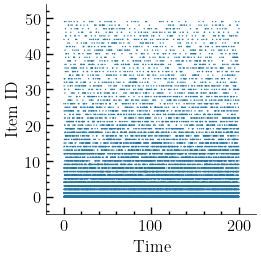
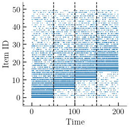
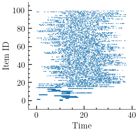

# Code of Online Caching Networks with Adversarial Guarantees

Simulator of experiments presented in 
> Y. Li, T. Si Salem, G. Neglia, and S. Ioannidis, "Online Caching Networks with Adversarial Guarantees", ACM SIGMETRICS / IFIP PERFORMANCE 2022. 

Please cite this paper if you intend to use this code for your research.

### Usage
The following is an execution example:
````
python CacheNetwork.py  res/fixed-popularity \
                        --graph_type dtelekom \
                        --cache_type TBGRD \
                        --min_capacity 1 \
                        --max_capacity 5 \
                        --query_nodes 5 \
                        --catalog_size 50 \
                        --demand_size 200 \
                        --min_weight 0 \
                        --max_weight 100 \
                        --time 1000 \
                        --action_selector_eta 0.1 \
                        --frequency -1 \
                        --trace_location traces/fixed_popularity_catalog_50.pkl
````
Executing the above script evaluates the caching policy TBGRD under the fixed popularity trace, with the following simulation parameters:
* select dtelekom network topology
* select TBGRG caching policy
* select from the set {1,...,5} the cache capacities
* generate demands from 5 nodes in the network
* set the catalog size to 50
* generate 200 different demands
* select from the interval \[0,100\] the edges weights 
* set the simulation time to 100 seconds  
* set the learning rate of the action selectorto 0.1
* freeze the colors selected by TBGRD 
* load the fixed popularity trace

### Synthetic Traces and Plotting Tools

The synthetic traces are available in the ``traces/`` directory, and we also provide a jupyter notebook [``tweak_traces.ipynb``](tweak_traces.ipynb) to tweak the traces.

[Fixed Popularity](traces/fixed_popularity_catalog_50.pkl) |  [Changing Popularity](traces/changing_popularity_catalog_50.pkl) | [Poisson Shot Noise](traces/PSN_catalog_100.pkl)
:-------------------------:|:-------------------------:|:-------------------------:
  |   |  

We provide the following plotting tools:

* [``plot_sensitivity.py``](plot_sensitivity.py) is used for sensitivity analysis, and corresponding plots are in ``sen_result/``.
* jupyer notebook [``plot_bars_uc.ipynb``](plot_bars_uc.ipynb) is used to plot bar plots under different configurations and plot the update costs.

The directory ``res/`` contains precomputed results, and ``figs/`` directory  contains precomputed figures.

### Dependencies

The dependencies are specified in the [``requirements.txt``](requirements.txt) file. 

### Command-line arguments


````
Simulate a Network of Caches

positional arguments:
  outputfile            Output file

optional arguments:
  --max_capacity MAX_CAPACITY
                        Maximum capacity per cache (default: 6)
  --min_capacity MIN_CAPACITY
                        Minimum capacity per cache (default: 3)
  --max_weight MAX_WEIGHT
                        Maximum edge weight (default: 100.0)
  --min_weight MIN_WEIGHT
                        Minimum edge weight (default: 1.0)
  --max_rate MAX_RATE   Maximum demand rate (default: 1.0)
  --min_rate MIN_RATE   Minimum demand rate (default: 1.0)
  --time TIME           Total simulation duration (default: 5000.0)
  --warmup WARMUP       Warmup time until measurements start (default: 0.1)
  --catalog_size CATALOG_SIZE
                        Catalog size (default: 100)
  --demand_size DEMAND_SIZE
                        Demand size (default: 500)
  --demand_change_rate DEMAND_CHANGE_RATE
                        Demand change rate (default: 0.0)
  --demand_distribution {powerlaw,uniform}
                        Demand distribution (default: powerlaw)
  --powerlaw_exp POWERLAW_EXP
                        Power law exponent, used in demand distribution
                        (default: 1.2)
  --query_nodes QUERY_NODES
                        Number of nodes generating queries (default: 10)
  --graph_type {path,erdos_renyi,balanced_tree,hypercube,cicular_ladder,cycle,grid_2d,lollipop,expander,hypercube,star,barabasi_albert,watts_strogatz,regular,powerlaw_tree,small_world,geant,abilene,dtelekom,servicenetwork}
                        Graph type (default: erdos_renyi)
  --graph_size GRAPH_SIZE
                        Network size (default: 100)
  --graph_degree GRAPH_DEGREE
                        Degree. Used by balanced_tree, regular,
                        barabasi_albert, watts_strogatz (default: 4)
  --graph_p GRAPH_P     Probability, used in erdos_renyi, watts_strogatz
                        (default: 0.1)
  --random_seed RANDOM_SEED
                        Random seed (default: 123456789)
  --debug_level {INFO,DEBUG,WARNING,ERROR}
                        Debug Level (default: INFO)
  --cache_type {LRU,FIFO,LFU,RR,EWMAGRAD,LMIN,TBGRD}
                        Networked Cache type (default: LRU)
  --query_message_length QUERY_MESSAGE_LENGTH
                        Query message length (default: 0.0)
  --response_message_length RESPONSE_MESSAGE_LENGTH
                        Response message length (default: 0.0)
  --monitoring_rate MONITORING_RATE
                        Monitoring rate (default: 1.0)
  --interpolate INTERPOLATE
                        Interpolate past states, used by LMIN (default: False)
  --beta BETA           Beta used in EWMA (default: 1.0)
  --gamma GAMMA         Gamma used in LMIN (default: 0.1)
  --expon EXPON         Exponent used in LMIN (default: 0.5)
  --T T                 Shuffling period used in LMIN and TBGRD (default: 1)
  --colors COLORS       Number of colors used in TBGRD (default: 100)
  --frequency FREQUENCY
                        Frequency of color updates used in TBGRD. When set to
                        -1 there is no update (default: -1)
  --batch BATCH         Whether requests are batched in TBGRD (default: False)
  --samples SAMPLES     Number of samples to estimate expected cache gain
                        (default: 100)
  --trace_location TRACE_LOCATION
                        Generate demands from an external trace (default:
                        None)
  --action_selector_eta ACTION_SELECTOR_ETA
                        Learning rate used in TBGRD ActionSelectors (default:
                        0.005)
  --correlated_action_selectors CORRELATED_ACTION_SELECTORS
                        Enable correlated arms for action selectors (default:
                        False)
  --adversarial_setting ADVERSARIAL_SETTING
                        Run abilene in adversarial setting (default: False)

````


